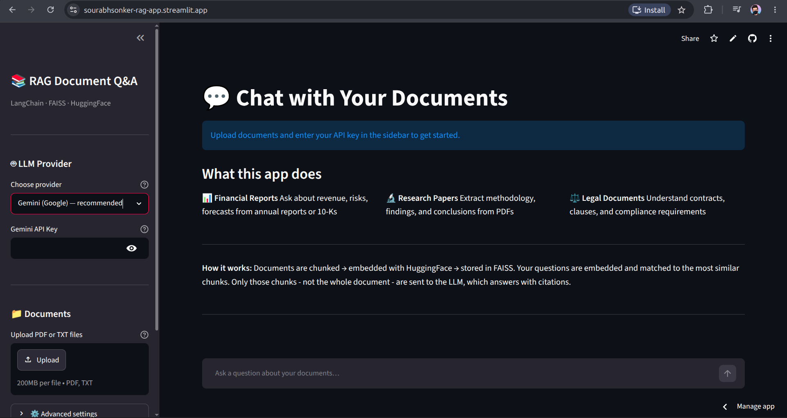

# RAG Document Q&A System


> **What if you could have a conversation with any document?**  
> An end-to-end RAG pipeline that retrieves answers directly from your uploaded PDFs — grounded in source text, with citations, and zero hallucination. No fine-tuning. No retraining. Upload and ask.

[**Streamlit App Link**](https://sourabhsonker-rag-app.streamlit.app/) &nbsp;

---

## The Problem It Solves

Standard LLMs answer from training data — it is static, unverifiable, and prone to hallucination. When an analyst asks "what was Q3 revenue?" or a lawyer asks "what are the termination clauses in this contract?" they need answers traceable to a specific document, not a model's best guess from memory.

The deeper challenge is that documents are long. A 50-page annual report cannot be stuffed into a single prompt — and even if it could, the model would lose focus and blend relevant and irrelevant passages together. That is exactly the problem Retrieval-Augmented Generation solves.

This project builds a production-style RAG system where the LLM never sees the full document. It only sees the three most relevant passages retrieved at query time — and is explicitly instructed to answer from those passages alone. The result is answers that are accurate, specific, and always traceable to a source.

---

## Live Demo


*Upload any PDF or TXT file, enter your API key, and start querying. Every answer links back to the exact chunk it was drawn from — filename and page number included.*

---

## Architecture

The system runs in two distinct phases that share a FAISS vector index:

```
INDEXING PHASE — runs once per document upload
───────────────────────────────────────────────────────────
PDF / TXT  →  PyPDF2 extracts text page by page
           →  RecursiveCharacterTextSplitter creates 800-char chunks (100-char overlap)
           →  all-MiniLM-L6-v2 converts each chunk to a 384-dimensional vector
           →  FAISS stores all vectors in an optimised similarity-search index

QUERY PHASE — runs on every user question, under 2 seconds
───────────────────────────────────────────────────────────
Question   →  same HuggingFace model embeds the query (must be same model — see below)
           →  cosine similarity search finds top-3 closest chunks in FAISS
           →  top-3 chunks + question sent to LLM with anti-hallucination system prompt
           →  answer returned with source citations (document name + page number)
```

**Why this prevents hallucination:** The system prompt passed to the LLM contains a hard instruction: *"Answer using ONLY the information in the context below. If the answer is not in the context, say so."* The LLM is reasoning over your documents — not its training weights. It has no choice but to stay grounded because it is never given the opportunity to speculate.

---

## What the System Does — Capability by Use Case

**Financial Reports**  
Ask about revenue figures, segment performance, cost breakdowns, and forward guidance from annual reports, 10-Ks, or earnings summaries. The system handles tables by extracting their text content during PDF parsing.

> *"Which segment grew fastest in FY2024, and what drove it?"*  
> *"What is the 2025 revenue guidance and what assumptions does it rest on?"*

**Research Papers**  
Extract methodology, sample sizes, key results, and limitations from academic PDFs. Multi-turn memory means you can drill down across several follow-up questions without restating context.

> *"What was the diagnostic accuracy of GPT-4o vs Claude 3?"*  
> *"How did structured prompting affect hallucination rates compared to unstructured?"*

**Legal Documents**  
Query contracts, term sheets, and policy documents for specific clauses, thresholds, and obligations — the kind of extraction that takes a paralegal hours to do manually.

> *"What is the liquidation preference, and is it participating or non-participating?"*  
> *"Which provisions are legally binding before the definitive agreement is signed?"*

**Cross-Document Reasoning**  
Upload multiple documents simultaneously. The unified FAISS index allows a single question to pull evidence from different files.

> *"Based on the employee handbook and the term sheet, what happens to unvested options if the company is acquired?"*

---

## Technical Decisions and Why

**`RecursiveCharacterTextSplitter` over `CharacterTextSplitter`**  
The recursive splitter tries to cut at natural boundaries in order: paragraph breaks (`\n\n`) → line breaks (`\n`) → sentence ends (`. `) → words (` `) → characters as a last resort. This preserves semantic units — a sentence is never broken mid-thought unless there is no alternative. `CharacterTextSplitter` cuts at a fixed character every time, often slicing sentences in half and degrading retrieval quality.

**Chunk overlap of 100 characters**  
Without overlap, context at chunk boundaries is lost. A sentence that starts in chunk 4 and finishes in chunk 5 would never be fully retrieved by either. A 100-character overlap (≈75 words) ensures every boundary sentence appears in full in at least one chunk. The cost is ~12% index size increase — a worthwhile tradeoff.

**`all-MiniLM-L6-v2` over paid embedding APIs**  
OpenAI's `text-embedding-ada-002` is excellent but costs money per token. For a portfolio project with unpredictable traffic, a free local model is the right call. `all-MiniLM-L6-v2` has 22M parameters, outputs 384-dimensional vectors, and runs on CPU with no API dependency. Retrieval quality is competitive for standard document Q&A tasks.

**The same model for indexing and querying — a non-obvious constraint**  
Every embedding model defines its own coordinate space. If you index chunks with Model A and embed the query with Model B, the coordinates are incompatible — the query lands in the wrong region of the index and retrieves irrelevant chunks. This is not an error that throws an exception; it silently returns wrong answers. Using the exact same `HuggingFaceEmbeddings(model_name=...)` call in both phases is mandatory, not optional.

**FAISS over ChromaDB for this use case**  
ChromaDB offers persistence (the index survives restarts) and richer metadata filtering. FAISS is in-memory and rebuilt on each upload. For a demo application with per-session document uploads, persistence is not needed — and FAISS is simpler to set up, zero-dependency, and faster for similarity search at small-to-medium scale. ChromaDB is the production upgrade path when persistence matters.

**`k=3` retrieval chunks**  
This is the number of document chunks sent to the LLM as context per question. Too few (`k=1`) risks missing relevant context if an answer spans multiple passages. Too many (`k=8+`) adds noise and increases token cost. `k=3` is the empirically standard starting point for RAG systems and covers the vast majority of question types in document Q&A. It is configurable via the Advanced Settings slider in the UI.

**`temperature=0.2` for the LLM**  
Temperature controls randomness. At `0.0` the model is fully deterministic; at `1.0` it is creative but unreliable. For factual document Q&A, low temperature (0.1–0.3) is correct — answers should be consistent and accurate, not varied. `0.2` allows minor phrasing variation while keeping factual content stable across repeated queries.

**`ConversationBufferMemory` for multi-turn context**  
Without memory, follow-up questions like *"What about last year?"* lose all context — the model has no idea what "last year" refers to. `ConversationBufferMemory` stores the full conversation history as structured messages and injects it into each new query. The `ConversationalRetrievalChain` uses this history to rephrase follow-up questions into standalone queries before searching FAISS — so *"What about last year?"* becomes *"What was the Q3 revenue in the prior fiscal year?"* before retrieval begins.

---

## Stack

| Layer | Tools |
|---|---|
| Document parsing | PyPDF2 |
| Text chunking | LangChain `RecursiveCharacterTextSplitter` |
| Embeddings | HuggingFace `sentence-transformers/all-MiniLM-L6-v2` (local, free) |
| Vector store | FAISS (Meta AI) |
| LLM — Option 1 | Google Gemini 2.5 Flash via `langchain-google-genai` |
| LLM — Option 2 | Groq + Meta Llama 3 via `langchain-groq` |
| RAG orchestration | LangChain `ConversationalRetrievalChain` |
| Conversation memory | LangChain `ConversationBufferMemory` |
| App | Streamlit |
| Environment | `python-dotenv` |

---

## Quickstart

```bash
git clone https://github.com/Sourabh1710/rag-qa-app
cd rag-qa-app

python -m venv venv
source venv/bin/activate          # Windows: venv\Scripts\activate

pip install -r requirements.txt

cp .env.example .env              # add your API key (see below)
streamlit run app.py
```

**Get a free API key — no credit card required:**
- **Gemini 2.5 Flash:** https://aistudio.google.com/ → Get API Key (1,500 req/day free)
- **Groq (Llama 3):** https://console.groq.com/ → API Keys (14,400 req/day free)

> **First-run note:** The HuggingFace embedding model (~90 MB) downloads automatically on first launch and is cached locally. Every subsequent run loads it from cache in seconds.

---

## Project Structure

```
rag-qa-app/
├── app.py                        ← Streamlit UI: session state, chat interface, source citations
├── rag/
│   ├── __init__.py
│   ├── document_processor.py     ← PDF/TXT extraction + RecursiveCharacterTextSplitter chunking
│   ├── vector_store.py           ← HuggingFace embeddings + FAISS index (cached with @st.cache_resource)
│   ├── llm_chain.py              ← Gemini / Groq init + ConversationalRetrievalChain assembly
│   └── memory.py                 ← ConversationBufferMemory for multi-turn conversation
├── requirements.txt
├── .env.example
└── README.md
```

---


*Supports Google Gemini 2.5 Flash and Groq Meta Llama 3 · Embeddings run fully local via HuggingFace · No data stored server-side*
